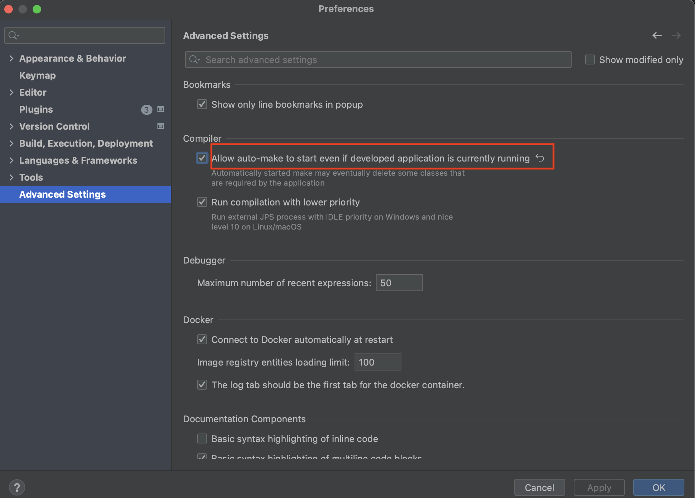

## Student-Grading-Micronaut

    A sample application to set up fast local development with hot reload inside docker.

## Outcome

By doing `docker-compose up` inside working directory one should be able to run the Micronaut or
Spring-Boot applications.
Not just that, While your application is running, Make changes inside source directory, And then you
would see that the changes automatically reflected inside docker.

### What all you need to achieve outcome?

- Make sure that you have Docker and Docker-Compose installed
    - Windows or macOS: [Install Docker Desktop](https://www.docker.com/get-started/)
    - Linux: [Install Docker](https://www.docker.com/get-started/) and
      then [Docker Compose](https://github.com/docker/compose)
- You just need to add `Dockerfile` and `docker-compose.yml` file to the working directory. Then the
  project structure would be as shown below.

```
<working-dir>
├── ...
├── src
|     └── ...
├── Dockerfile
├── docker-compose.yml
└── README.md
```

### Micronaut + Postgres + Docker

### Templates of Dockerfile and Docker-Compose

[Dockerfile](https://github.com/chinmaysomani07/student-grading-micronaut/blob/dockerise-setup/Dockerfile)

 ```dockerfile
FROM openjdk:11

WORKDIR /app

COPY .mvn .mvn
COPY mvnw pom.xml ./
RUN ./mvnw -T 4 dependency:go-offline

COPY src ./src

CMD ["./mvnw", "mn:run", "-Dmn.watch=true"]
 ```

[docker-compose.yml](https://github.com/chinmaysomani07/student-grading-micronaut/blob/dockerise-setup/docker-compose.yml)

 ```yaml
version: '3.8'
services:
  <application-name-as-service>:
    image: <image-name-of-your-application>
    container_name: <container-name>
    networks:
      - <network-name>
    build:
      context: .
    env_file: .env
    depends_on:
      - db
    ports:
      - ${APPLICATION_PORT_ON_DOCKER_HOST}:${APPLICATION_PORT_ON_CONTAINER}
    volumes:
      - ./:/app
    #command to run micronaut application
    command: ./mvnw mn:run -Dmn.watch=true

  db:
    container_name: <db-service-container-name>
    image: postgres:14.1-alpine
    env_file: .env
    environment:
      - POSTGRES_DB=${DB_NAME}
      - POSTGRES_USER=${POSTGRES_USER}
      - POSTGRES_PASSWORD=${POSTGRES_PASSWORD}
    ports:
      - ${DB_PORT_ON_DOCKER_HOST}:${DB_PORT_ON_CONTAINER}
    volumes:
      - <volume-nam-on-docker-host>:/var/lib/postgresql/data
    networks:
      - <network-name>

volumes:
  <volume-name-on-docker-host>:

networks:
  <network-name>:

 ```

Here each service acts as new container. Since our application is dependent on `db` service, We need
to take care of few things like -

- `<application-name-as-service>` service shouldn't start before `db` service. And that is why we
  used `depend_on` property under `<application-name-as-service>`.
- `<application-name-as-service>` service and `db` both has to be on the same network. So that they
  can communicate each other. If we don't provide any network to services, They might run in
  isolated networks which leads to communication link failure b/w application and database.
- Finally, To happen hot reload inside docker, Our current directory(where the source code exists)
  should be mounted to working directory inside container.

```yaml
volumes:
  - ./:/app
```

### How to pass values to variables in `docker-compose.yml` file?

In this `docker-compose.yml` file, You would see that the variables used
like `${APPLICATION_PORT_ON_DOCKER_HOST}`, `${APPLICATION_PORT_ON_CONTAINER}`,  
`${DB_NAME}`, `${POSTGRES_USER}`, `${POSTGRES_PASSWORD}`, `${DB_PORT_ON_DOCKER_HOST}`
and `${DB_PORT_ON_CONTAINER}`. One might think(people new to docker) that how would we pass values
to
these variables? Well there are a couple of ways to do that, One is by defining under
the `environment` property of any service(example to refer, under `db` service). Other way is to
define all these values
inside [.env](https://github.com/chinmaysomani07/student-grading-micronaut/blob/dockerise-setup/.env)
file, And then map it to service with the property `env_file` as we did in
both `<application-name-as-service>` and `db` services.

### How to run docker-compose file?

Follow the commands to run docker-compose file

1. Change directory in Terminal or CMD to `<working-dir>`

> $ cd `<PATH-TO-WORKING-DIR>`

2. Run the `docker-compose-test.yml` file.

> $ docker-compose up -d

If you're running `doker-compose up -d` command for first time, It would take 7-10 minutes to pull
images(
openjdk:11) and downloading dependencies. If everything runs successfully, By doing `docker ps` you
would see the following outcome.

```
➜  student-grading-micronaut ✗ docker ps
CONTAINER ID   IMAGE                             COMMAND                  CREATED          STATUS          PORTS                                            NAMES
8247f3b42566   student-grading-micronaut-image   "./mvnw mn:run -Dmn.…"   29 seconds ago   Up 25 seconds   0.0.0.0:8080->8080/tcp           student-grading-micronaut-app
04a7dbf0c0e3   postgres:14.1-alpine              "docker-entrypoint.s…"   4 minutes ago    Up 4 minutes    5432/tcp                         student-grading-db
```

If application is failed to start, You would still figure why it fails by following below command.
> docker logs --follow <container-name>

Make actions a/c to logs.

## How to run E2E tests inside docker?

To run End-To-End(E2E) tests, We need to mock the server and database. One way to do that is by
using
[test containers](https://www.testcontainers.org/).

Following `docker-compose-test.yml` template would help to run test inside docker.

[docker-compose-test.yml](https://github.com/chinmaysomani07/student-grading-micronaut/blob/dockerise-setup/docker-compose-test.yml)

```yaml
version: '3.8'
services:

  tests:
    image: maven:3
    stop_signal: SIGKILL
    stdin_open: true
    tty: true
    working_dir: /app
    environment:
      - TESTCONTAINERS_HOST_OVERRIDE=host.docker.internal
    volumes:
      - ./:/app
      - /var/run/docker.sock:/var/run/docker.sock
      # Maven cache (optional), if .m2 repository isn't mounted, maven will download all
      # the dependencies mentioned in 'pom.xml' from mvn central repository.
      - ~/.m2:/root/.m2
    command: mvn clean test
```

Here `~/.m2` is specific to mac, If you're using different platform, Replace `~/.m2`
with `C:\Users\{your-username}\.m2` for windows or `/root/.m2` for linux.

Project structure after adding  `docker-compose-test.yml`

```
<working-dir>
├── ...
├── src
|     └── ...
├── Dockerfile
├── docker-compose.yml
├── docker-compose-test.yml
└── README.md
```

Follow the command to run tests inside docker.

1. Change directory in Terminal or CMD to `<working-dir>`

> $ cd `<PATH-TO-WORKING-DIR>`

2. Run the `docker-compose-test.yml` file.

> $ docker-compose -f docker-compose-test.yml up

If you're not mounting the `.m2` then it would time take to download all the dependencies mentioned
in `pom.xml`.

Once the dependencies mounted or downloaded, You would see the following logs as good sign -


## Spring-Boot + Postgres + Docker

Both the Spring-Boot and Micronaut are JVM based frameworks. There's no much difference among
Dockerfile and Docker-Composes files(comparing with above docker templates) except the command to
run the application.

As to achieve hot reload inside docker, We need add `devtools` dependency inside `pom.xml`.

Before going to take a look at templates of Docker and Docker-Compose file, You first need to
add `spring-boot-devtools` dependency to `pom.xml`. Since this dependency would help to reload the
application when the changes detected.

```xml

<dependency>
    <groupId>org.springframework.boot</groupId>
    <artifactId>spring-boot-devtools</artifactId>
    <scope>runtime</scope>
</dependency>
```

> Note: If you're using intellij, After adding `devtools` dependency enable the property
> the `Allow auto-make to start even if developed application is currently running` as shown.




Theb, Add `Dockerfile` and `docker-compose.yml` to the working directory.

Project structure after adding `Dockerfile` and `docker-compose.yml`

```
<working-dir>
├── ...
├── src
|     └── ...
├── Dockerfile
├── docker-compose.yml
├── docker-compose-test.yml
└── README.md
```

### Templates of Dockerfile and Docker-Compose

Dockerfile

```dockerfile
FROM openjdk:11

WORKDIR /app

COPY .mvn .mvn
COPY mvnw pom.xml ./
RUN ./mvnw -T 4 dependency:go-offline

COPY src ./src

CMD ["./mvnw", "spring-boot:run"]
```

docker-compose.yml

```yaml
version: '3.8'
services:
  <application-name-as-service>:
    image: <image-name-of-your-application>
    container_name: <container-name>
    networks:
      - <network-name>
    build:
      context: .
    env_file: .env
    depends_on:
      - db
    ports:
      - ${APPLICATION_PORT_ON_DOCKER_HOST}:${APPLICATION_PORT_ON_CONTAINER}
    volumes:
      - ./:/app
    #command to spring-boot application
    command: ./mvnw spring-boot:run

  db:
    container_name: <db-service-container-name>
    image: postgres:14.1-alpine
    env_file: .env
    environment:
      - POSTGRES_DB=${DB_NAME}
      - POSTGRES_USER=${POSTGRES_USER}
      - POSTGRES_PASSWORD=${POSTGRES_PASSWORD}
    ports:
      - ${DB_PORT_ON_DOCKER_HOST}:${DB_PORT_ON_CONTAINER}
    volumes:
      - <volume-nam-on-docker-host>:/var/lib/postgresql/data
    networks:
      - <network-name>

volumes:
  <volume-name-on-docker-host>:

networks:
  <network-name>:
```

Here each service acts as new container. Since our application is dependent on `db` service, We need
to take care of few things like -

- `<application-name-as-service>` service shouldn't start before `db` service. And that is why we
  used `depend_on` property under `<application-name-as-service>`.
- `<application-name-as-service>` service and `db` both has to be on the same network. So that they
  can communicate each other. If we don't provide any network to services, They might run in
  isolated networks which leads to communication link failure b/w application and database.
- Finally, To happen hot reload inside docker, Our current directory(where the source code exists)
  should be mounted to working directory inside container.

Follow the commands to run docker-compose file

1. Change directory in Terminal or CMD to `<working-dir>`

> $ cd `<PATH-TO-WORKING-DIR>`

2. Run the `docker-compose-test.yml` file.

> $ docker-compose up -d

If you're running `doker-compose up -d` command for time, It would take 7-10 minutes to pull images(
openjdk:11) and download dependencies. If everything runs successfully, By doing `docker ps` you
would see the following outcome.

```
➜  student-grading-micronaut ✗ docker ps
CONTAINER ID   IMAGE                             COMMAND                  CREATED          STATUS          PORTS                                            NAMES
8247f3b42566   student-grading-micronaut-image   "./mvnw spring-boot:…"   29 seconds ago   Up 25 seconds   0.0.0.0:8080->8080/tcp   student-grading-micronaut-app
04a7dbf0c0e3   postgres:14.1-alpine              "docker-entrypoint.s…"   4 minutes ago    Up 4 minutes    5432/tcp                 student-grading-db
```

If application is failed to start, You would still figure why it fails by following below command.
> $ docker logs --follow `<container-name>`

Make actions a/c to logs.

